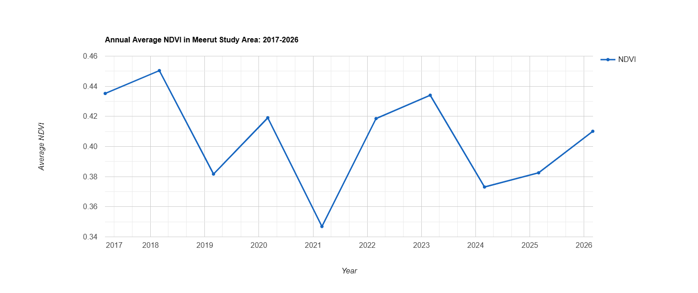
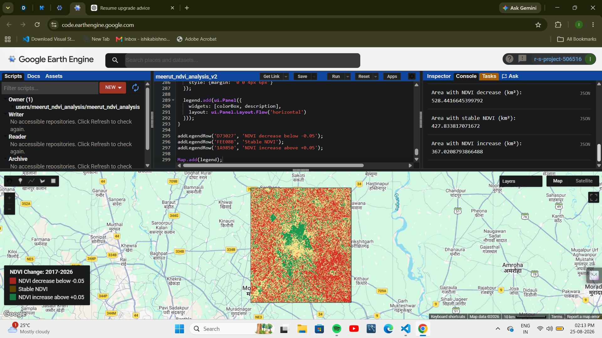

# Satellite-Based Vegetation Health Monitoring of Meerut Using Landsat 8/9 and NDVI

A remote-sensing project that analyses changes in vegetation greenness across a Meerut study area in Uttar Pradesh, India using Landsat satellite imagery and the Normalized Difference Vegetation Index (NDVI).

This is my first hands on remote-sensing project. I built it after completing NASA ARSET’s *Fundamentals of Remote Sensing* course to apply satellite-data concepts—including spectral bands, near-infrared reflectance, cloud masking, and NDVI—in a real Earth-observation analysis.

## Project Objective

This project compares vegetation greenness during the same seasonal window, March-April, across 2017, 2021, and 2026.

It answers:

> How has vegetation greenness in a Meerut study area changed over time, based on NDVI derived from Landsat 8/9 satellite imagery?

The analysis includes all visible green cover, such as crop fields, trees, grass, parks, and other vegetation. It is not a crop-yield or crop-type analysis.

## Key Findings

| Year | Mean NDVI |
| ---- | --------: |
| 2017 |    0.4352 |
| 2021 |    0.3469 |
| 2026 |    0.4101 |

* Mean NDVI declined by approximately **20.3%** from 2017 to 2021.
* Mean NDVI increased by approximately **18.2%** from 2021 to 2026.
* Despite this recovery, 2026 mean NDVI remained approximately **5.8% below** the 2017 value.
* The annual NDVI series from 2017 to 2026 shows year-to-year variation rather than a simple continuous decline or increase.

### Vegetation Change Area Statistics, 2017–2026

| NDVI change class           |       Area | Share of study area |
| --------------------------- | ---------: | ------------------: |
| NDVI decrease below −0.05   | 528.44 km² |               39.9% |
| Stable NDVI, −0.05 to +0.05 | 427.83 km² |               32.3% |
| NDVI increase above +0.05   | 367.02 km² |               27.7% |

These findings show an observed satellite-derived vegetation-greenness pattern. They do not establish the cause of change and should not be interpreted as crop yield, biodiversity, or direct ground-level plant-health measurements.

## NDVI Explained

NDVI measures vegetation greenness using the difference between near-infrared and red-light reflectance:

[
NDVI = \frac{NIR - Red}{NIR + Red}
]

Healthy vegetation absorbs red light for photosynthesis and strongly reflects near-infrared (NIR) energy. Therefore, higher NDVI values generally indicate denser and more photosynthetically active vegetation.

## Methodology

1. Defined a rectangular study area around Meerut, Uttar Pradesh.
2. Used Landsat 8 and Landsat 9 Collection 2, Level 2 surface-reflectance imagery.
3. Selected imagery from March-April for 2017, 2021, and 2026 to reduce seasonal variation.
4. Removed cloud, cloud-shadow, and dilated-cloud pixels using the Landsat `QA_PIXEL` band.
5. Applied Landsat surface-reflectance scaling.
6. Calculated NDVI from:

   * Red band: `SR_B4`
   * Near-infrared band: `SR_B5`
7. Created a median NDVI composite for each year.
8. Calculated the mean NDVI across the study area and compared results over time.
9. Created an annual March-April NDVI time series for every year from 2017 to 2026.
10. Calculated 2017–2026 NDVI change and classified pixels as decrease, stable, or increase using a ±0.05 NDVI threshold.
11. Calculated the area of each change class in square kilometres.

### Results

### Annual NDVI Trend, 2017–2026

### Vegetation Change Classes, 2017–2026

Red areas represent NDVI decrease below −0.05, yellow areas represent relatively stable NDVI, and green areas represent NDVI increase above +0.05.

## Tools and Technologies

* Google Earth Engine
* JavaScript
* Landsat 8/9 satellite imagery
* NDVI
* Google Drive exports
* Microsoft Excel for reviewing the exported summary data

## Limitations

* The main benchmark comparison focuses on 2017, 2021, and 2026, while the annual series is used to provide additional year-to-year context.

## Future Improvements

* Use the official Meerut district boundary instead of a rectangular study area.
* Compare pre-monsoon and post-monsoon vegetation patterns.
* Separate agricultural land, urban land, water, and forest/green cover.
* Validate the results using ground-level or official land-use data.

## Data Source

* [NASA/USGS Landsat Collection 2 Level 2](https://www.usgs.gov/landsat-missions/landsat-collection-2)
* [Google Earth Engine](https://earthengine.google.com/)
